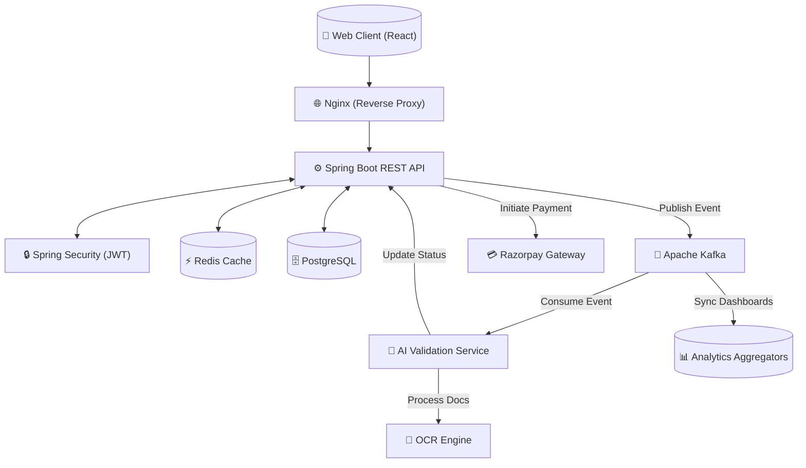
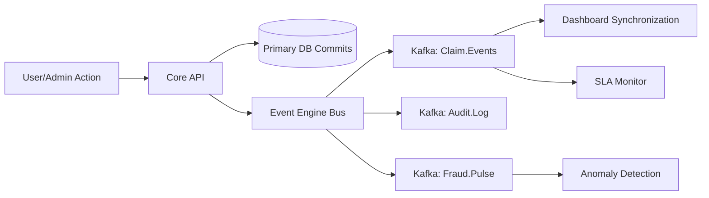
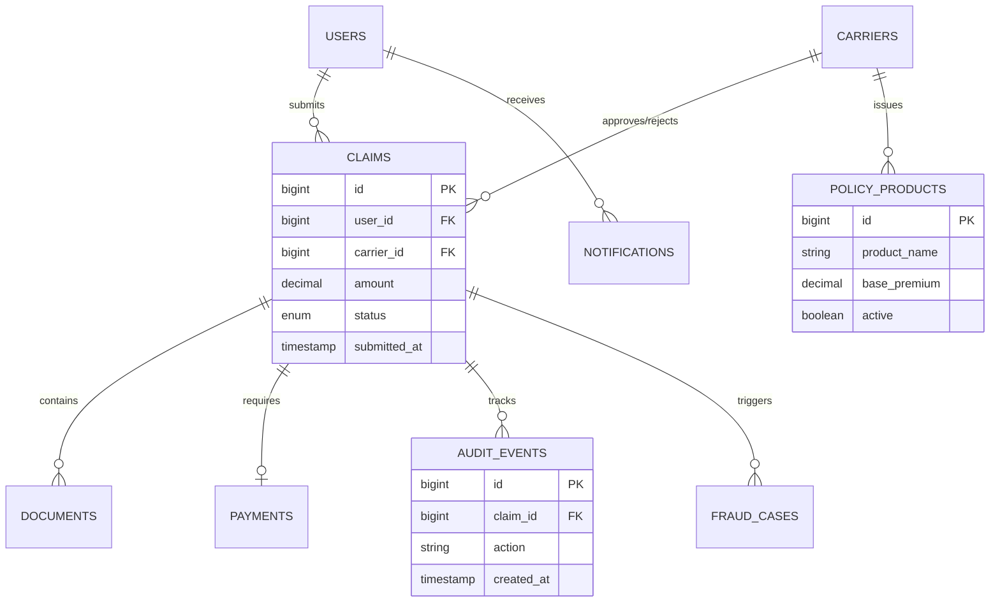
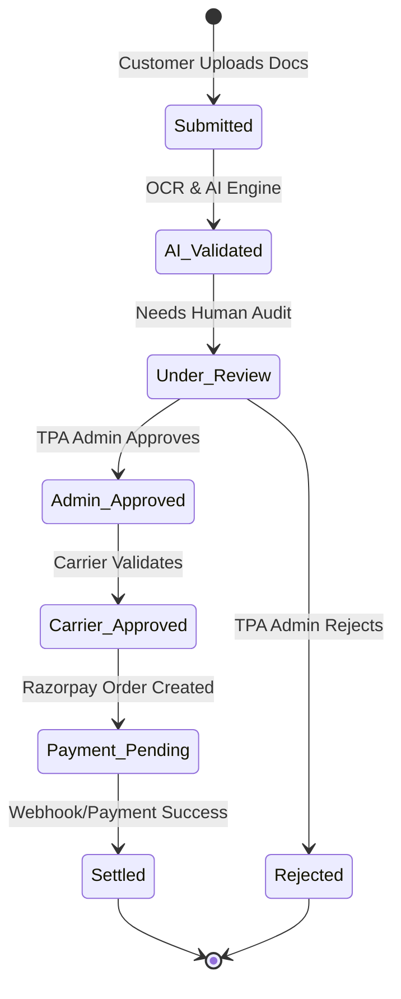
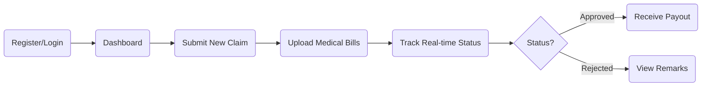
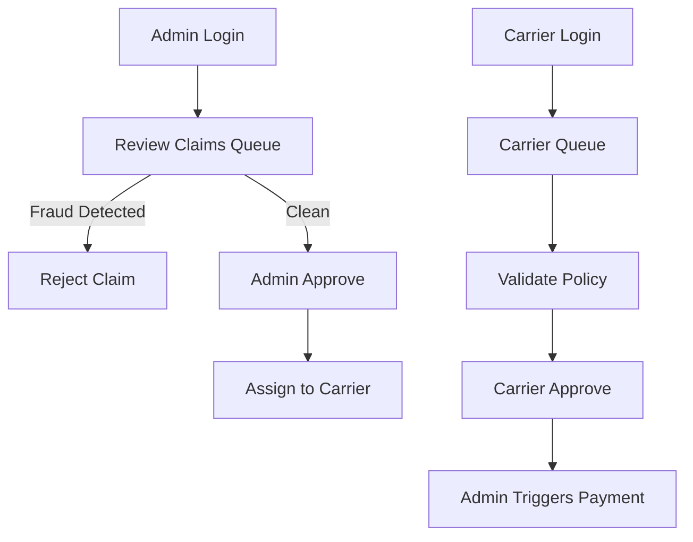
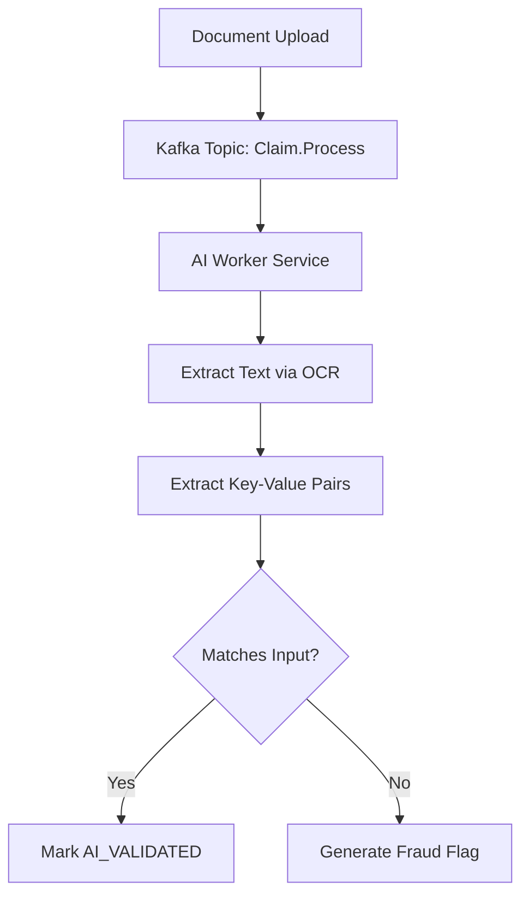
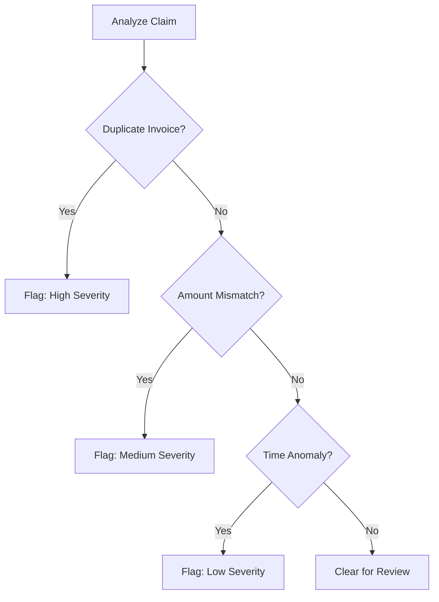
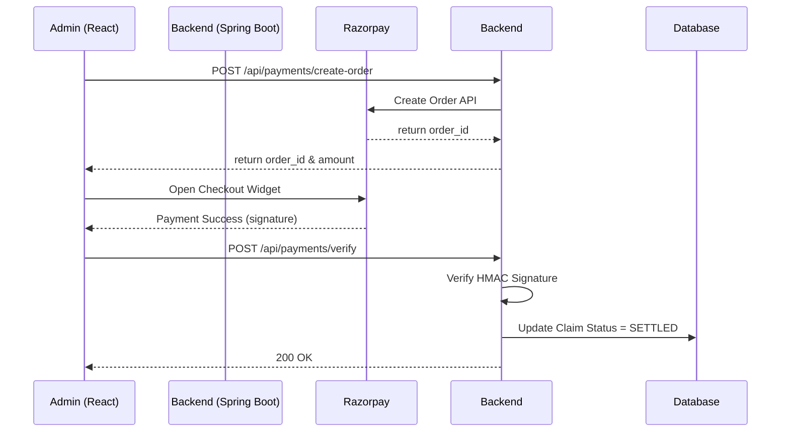
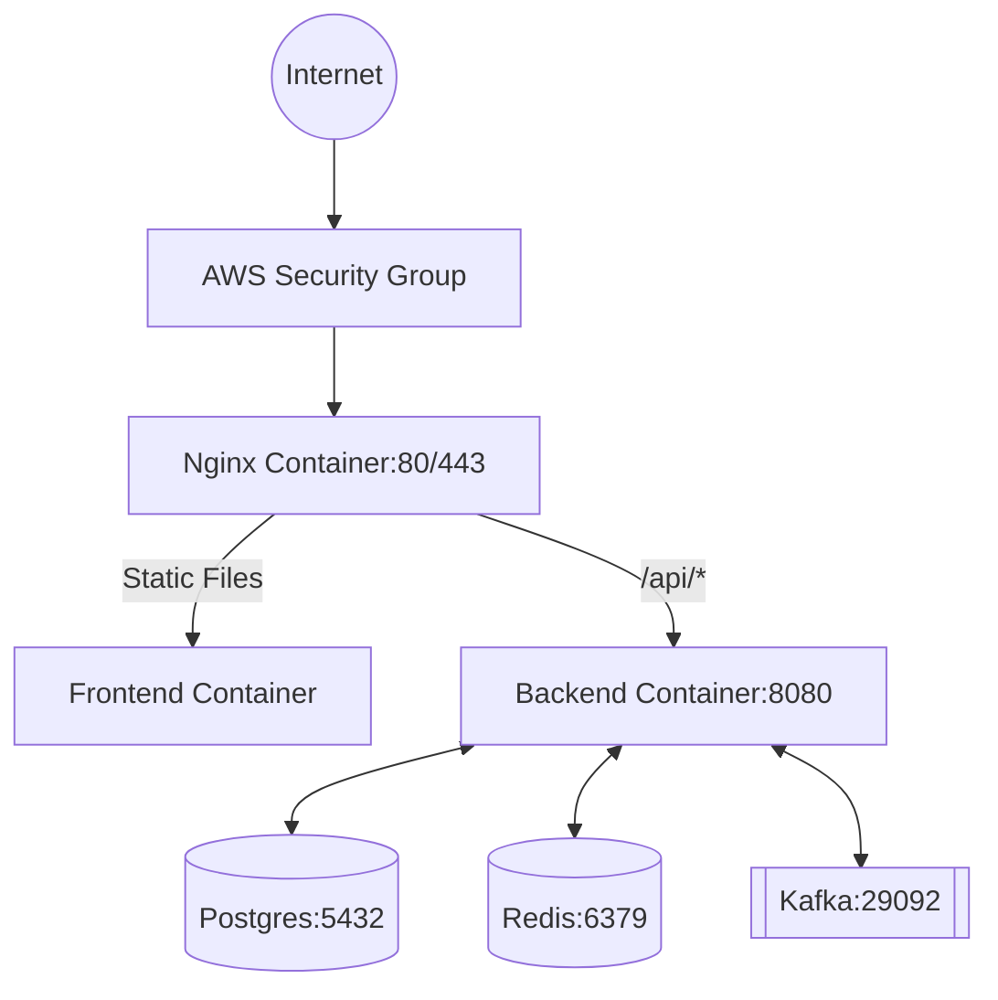

# 🏥 TPA Insurance Claim Processing System

> A next-generation, AI-powered Third-Party Administrator (TPA) enterprise platform designed to streamline healthcare insurance claims, automate fraud detection, orchestrate secure carrier payments, and provide multi-tenant operational intelligence at scale.

---

## 🌍 1. Enterprise Overview

The TPA Insurance Claim Processing System operates as a high-scale, multi-tenant ecosystem coordinating millions of events between customers, insurance carriers, and healthcare administrators.

- **AI-Driven TPA Ecosystem:** An interconnected web of specialized intelligence models handling everything from document validation to predictive anomaly detection.
- **Claim Lifecycle Orchestration:** Seamless, event-driven pipelines dynamically routing claims from initial ingestion through automated AI pre-checks, admin triage, and final carrier settlement.
- **Fraud Intelligence Platform:** Deep behavioral profiling and pattern recognition to flag multi-variate fraud indicators in real-time.
- **Operational SLA Monitoring:** Live countdowns, breach forecasting, and intelligent queue routing to ensure adherence to strict carrier service-level agreements.
- **Enterprise Analytics & Real-Time Dashboards:** Bloomberg-style terminals providing financial insights, utilization heatmaps, and provider network optimization metrics.
- **Automated Settlements:** High-throughput batch settlement engines and integrated payment gateways executing precise financial transactions at scale.

**Interaction Model:**
- **Customers** submit claims, track journey milestones, and manage family policies through a user-centric digital wallet.
- **AI Systems** act as the first line of defense, parsing documents via OCR, cross-validating policy rules, and generating risk severity scores before human interaction.
- **Admins** manage intelligent workbaskets, balancing queue congestion and handling AI-flagged escalations.
- **Carriers** utilize high-level treasury analytics and bulk settlement engines to fund approved claims and configure their hospital networks.
- **Kafka Events** bind the entire architecture, broadcasting state transitions, SLA breaches, and financial anomalies asynchronously.

---

## 🧱 2. Tech Stack

### Backend
- **Core Framework:** Spring Boot (Java 17)
- **Security:** Spring Security with stateless JWT Authentication, RBAC
- **ORM & Data Access:** Hibernate / Spring Data JPA
- **Database:** PostgreSQL 15
- **Message Broker:** Apache Kafka (Event Streaming & Operations Sync)
- **Caching:** Redis (Performance optimization, Session stores, Event Caching)

### Frontend
- **Framework:** React 18 (Vite)
- **Styling:** Tailwind CSS, Framer Motion for Micro-Animations
- **Network:** Axios
- **State Management:** React Context API / Custom Providers

### DevOps & Infrastructure
- **Containerization:** Docker & Docker Compose
- **Web Server / Proxy:** Nginx
- **Deployment:** AWS EC2 (Production environment)

### AI & Automation Layer
- **Validation Engine:** AI-powered rule validation and document parsing
- **OCR:** Optical Character Recognition for automated data extraction from claim forms
- **Fraud Detection:** Algorithmic risk scoring, historical anomaly tracking, and pattern matching

---

## 🏗️ 3. Advanced System Architecture

The application follows a resilient, event-driven microservices-inspired monolithic architecture. It decouples heavy processing (AI validation, financial orchestration, SLA monitoring) via Kafka event streams and relies heavily on Redis for high-throughput state synchronization.

---

## 🏢 4. Enterprise Portals Documentation

The platform serves three distinct user domains through specialized portals:

### 📱 Customer Portal
Designed for empathy, transparency, and utilization management.
- **Smart Claim Submission:** Multi-step wizard with built-in AI pre-checks.
- **Claim Journey Timeline:** Live tracking from ingestion to final reimbursement.
- **Insurance Utilization Dashboard:** Visual tracking of consumed limits, deductibles, and co-pays.
- **Wallet & Reimbursement Center:** Financial ledger for all payouts.
- **Family Coverage Manager:** Central hub to manage dependents under floater policies.
- **Hospital Network Explorer:** Geolocated search for active PPN (Preferred Provider Network) facilities.
- **Download Center & Policy Document Vault:** Secure storage for issued policies and tax certificates.
- **Premium Reminders & Notifications:** Real-time push alerts via SSE.

### 🛡️ Admin Portal
Designed for high-throughput triage and operational control.
- **Intelligent Workbasket:** Claim assignments routed by priority, SLA, and complexity.
- **OCR Validation Queue:** Side-by-side comparison of user data versus AI-extracted documents.
- **Fraud Investigation Hub:** Deep dive into AI-generated flags, user history, and similar claims.
- **SLA Breach Center:** Countdown timers and escalation engines for aging tickets.
- **Kafka Monitoring & Rule Engine Dashboard:** System health and configuration of auto-adjudication thresholds.
- **Agent Productivity Analytics:** Performance tracking and queue balancing.
- **Payment Reconciliation & Blacklist Manager:** Managing hospital/user suspensions.

### 🏛️ Carrier Portal
Designed for financial intelligence and macro-level risk management.
- **Operations Command Center:** Executive overview of total exposure, daily intake, and settlement velocity.
- **Financial Intelligence Dashboard:** Bloomberg-style terminal for treasury operations.
- **SLA Mission Control:** Monitoring TPA performance against contractual benchmarks.
- **Insurance Product Marketplace:** Definition of limits, exclusions, and waiting periods.
- **Policy Heatmap Intelligence:** GIS-based visualization of utilization spikes across regions.
- **Bulk Settlement Engine:** Mass approval and funding orchestration.
- **Fraud Intelligence Center & Reinsurance Export:** Exporting anomaly patterns to underwriters.
- **Loss Ratio Forecasting & Leakage Prevention:** Identifying systemic overpayments or network inflation.

---

## 🩺 5. Insurance Product Ecosystem

The platform natively supports complex, multi-tiered insurance products:

| Insurance Plan | Coverage Scope | Premium Structure | Exclusions & Nuances |
|---|---|---|---|
| **Accident Insurance** | Emergency trauma, out-patient casualty | Low base, high volume | High-risk sports exclusion |
| **AD&D** | Accidental Death & Dismemberment | Fixed schedule payout | Pre-existing illness exclusion |
| **Hospitalization Insurance** | Room rent, ICU, surgeon fees, consumables | Age-banded, tiered | 30-day waiting period |
| **Critical Illness Insurance** | Lump-sum payout upon diagnosis | Fixed rider or standalone | 90-day survival period |
| **Family Floater** | Shared sum-insured across dependents | Age of eldest member | Maternity wait limits apply |
| **Senior Citizen Plan** | Higher co-pay, focused on geriatric care | High premium, risk-adjusted | Specific ailment caps (e.g., cataracts) |
| **Corporate Employee Plan** | Day 1 coverage, maternity included | Employer funded, group rates | Tied to employment status |
| **Maternity Insurance** | Delivery, pre/post-natal care, newborn cover | High premium rider | 9-24 month waiting periods |
| **OPD & Wellness** | Doctor consults, pharmacy, diagnostics | Subscription/utilization basis | Dental/Vision often capped |
| **Recuperative Care** | Post-discharge nursing, rehab | Add-on rider | Max days limit |
| **Cancer Care** | Targeted therapy, chemo, radiation | Staged payout based on severity | Non-malignant exclusions |
| **Cardiac Care** | Stents, bypass, pacemaker | Specialized tier | Strict pre-existing conditions |

*Each product includes deeply configured metrics for utilization tracking, approval ratios, risk scoring, and rider support.*

---

## ⚡ 6. Enterprise Event Engine

The `EnterpriseEventEngine` serves as the nervous system of the platform, utilizing Apache Kafka and local Spring Application Events to synchronize the multi-tenant architecture.

- **Centralized Event Orchestration:** Decouples UI updates from transactional commits.
- **SLA Breach Broadcasting:** Pushes countdown alerts to Admin SOC terminals.
- **Financial Anomaly Propagation:** Triggers immediate lockdown of payout batches if fraud score crosses thresholds.
- **Queue Balancing Events:** Re-routes pending claims if an admin agent logs off.
- **Real-Time Operational Simulation:** Allows testing environments to mimic high-load scenarios.

### Event Propagation Architecture

---

## 🧠 7. Real-Time Intelligence Systems

The platform provides live operational awareness instead of static reporting:
- **Live Settlement Feeds:** Streaming tickers of approved payouts.
- **Fraud Pulse Detection:** Real-time scoring of incoming claims against historical bad actors.
- **Real-Time SLA Countdowns:** Visual timers across all Admin workbaskets.
- **Queue Congestion Monitoring:** Alerts when intake velocity exceeds adjudication capacity.
- **Actuarial Forecasting & Reimbursement Velocity:** Predicting end-of-month cash flow requirements based on current queue depth.

---

## 🗄️ 8. Database Expansion

The database has been expanded to support enterprise telemetry and product complexity.

### Extended Tables
| Table Name | Description |
|---|---|
| **`notifications`** | Real-time user/admin alerts with read state. |
| **`audit_events`** | Granular lifecycle tracking mapping every system state change. |
| **`sla_breaches`** | Records of claims that violated resolution timeline contracts. |
| **`provider_networks`** | Hospital and clinic mapping with risk ranking. |
| **`policy_products`** | Metadata defining the 12+ insurance plans and their limits. |
| **`fraud_cases`** | Escalated instances requiring deep SIU investigation. |
| **`reimbursement_transactions`** | Ledger of all financial movements. |
| **`settlement_batches`** | Grouped payments for carrier bulk-funding. |
| **`product_utilization_metrics`** | Pre-calculated aggregates for carrier heatmaps. |

### Updated ER Diagram

---

## 🔁 9. Application Workflow

### Claim Lifecycle Flow

---

## 👤 10. User Flow Diagrams

### Customer Flow

### Admin & Carrier Flow

---

## 🤖 11. AI Validation Flow

The AI layer reduces human workload by automatically parsing documents and checking for discrepancies before human intervention.

---

## 🚨 12. Fraud Detection Flow

The fraud detection system uses deterministic algorithms and AI risk scoring to protect the carrier.

---

## 💳 13. Payment Flow (Razorpay)

Payments are securely orchestrated through the Razorpay integration using server-to-server verification.

---

## 🎨 14. Enterprise UI/UX Documentation

The platform leverages specialized architectural metaphors to optimize user workflows:
- **NOC/SOC Command Center:** Dark mode, high-contrast UI for Admin SLA centers.
- **Bloomberg Treasury Terminal:** Dense, data-rich grids for Carrier Financial Dashboards.
- **Aviation Radar HUD:** Blinking pulse indicators for live fraud detection events.
- **GIS Heatmap Intelligence:** Interactive map overlays for regional utilization analysis.
- **Consumer Digital Wallet:** Clean, glassmorphic interfaces for Customer reimbursement centers.

*These distinct visual paradigms ensure that context switching is intuitive based on the user's operational role.*

---

## 🔐 15. Production Hardening & Security Architecture

The platform is fortified for critical enterprise healthcare environments:
- **RBAC & Context Isolation:** Deep validation ensuring Admins cannot view inter-carrier data, and users cannot access peer claims.
- **JWT & Stateless Authentication:** Hardened token parsing.
- **Defensive React Patterns & Error Boundaries:** Fallback UI rendering prevents application crashes on malformed data streams.
- **Kafka / Redis Recovery:** Automatic connection retries, dead-letter queues, and fallback to direct database queries if the cache invalidates.
- **Transaction Safety:** Strict ACID compliance for settlement batches ensuring no double-payouts occur.

---

## 📡 16. API Documentation Expansion

| Method | Endpoint | Role | Description |
|---|---|---|---|
| `GET`  | `/api/v1/analytics/treasury` | `CARRIER` | Fetch real-time settlement forecasting |
| `GET`  | `/api/v1/fraud/pulse` | `ADMIN` | Stream real-time anomaly scores |
| `GET`  | `/api/v1/sla/breaches` | `ADMIN` | Fetch claims violating resolution time |
| `POST` | `/api/v1/payments/batch-settle` | `CARRIER` | Execute mass bulk payment |
| `GET`  | `/api/v1/audit/{claimId}` | `ALL` | Retrieve immutable lifecycle history |
| `GET`  | `/api/v1/notifications/stream` | `ALL` | SSE endpoint for live alerts |

---

## 🧪 17. Testing Strategy

- **Unit Testing:** JUnit 5 and Mockito.
- **Integration Testing:** Spring Boot `@WebMvcTest` with H2.
- **E2E Testing:** Playwright browser automation.
- **AI Validation Testing:** Dedicated test cases for OCR thresholds.

---

## 🚀 18. Deployment & Operations

The application utilizes Docker orchestration to guarantee consistency across environments.

- **Container Topology:** Decoupled instances of Frontend (Nginx), Backend (Spring), Postgres, Redis, and Kafka.
- **Scaling Strategy:** Backend APIs are stateless allowing horizontal pod autoscaling. Kafka handles traffic spikes gracefully.
- **Nginx Routing:** Terminating SSL and routing `/api` safely to the backend VPC.
- **Observability:** Centralized health checks for DB and Messaging queues via Spring Actuator.

---

## 🎭 19. Demo Data & Simulation System

The system includes a sophisticated `EnterpriseDemoDataSeeder` and `DemoDataProvider` to instantly populate the database with realistic operational metrics.

- **Fake Streams:** Simulates incoming claims, OCR extractions, and fraud flags.
- **Seeded Entities:** Pre-loads Hospitals (PPN), Products, and Audit Events.

### 🔑 Demo Credentials

> **Note:** Use these exclusively in local or staging demo environments. DO NOT use these in production.

- **ADMIN:** `mithun-io@outlook.com` *(Password: `password123`)*
- **CUSTOMER:** `aerica.pancake@allfreemail.net` *(Password: `password`)*
- **CARRIER:** `pwgcy57804@minitts.net` *(Password: `password`)*

---
